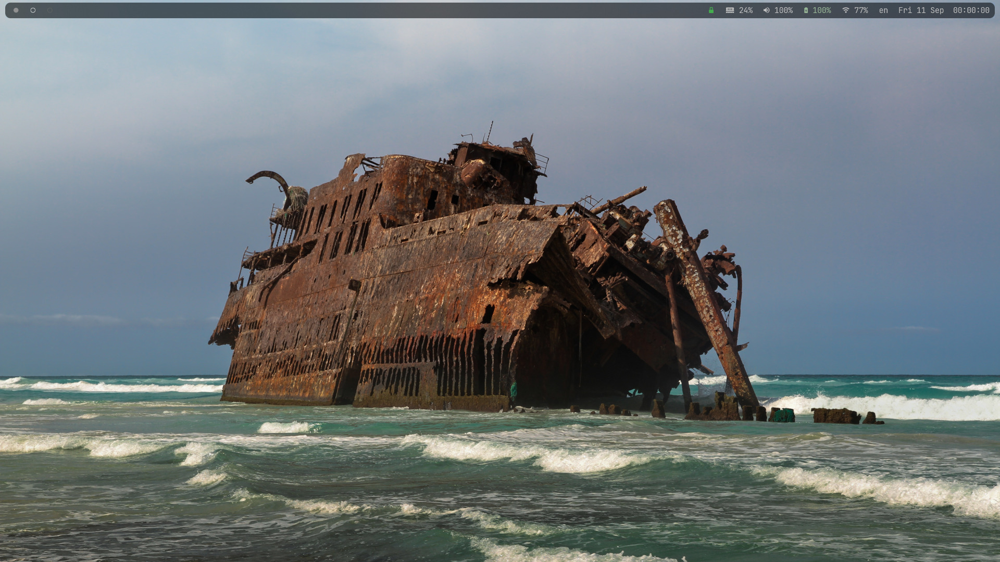

<div align="center">

**A machine-neutral Arch Linux workspace built around the
[niri](https://github.com/YaLTeR/niri) tiling compositor and a
keyboard-driven terminal stack, everything in JetBrains Mono.**



</div>

The base system comes from the
[Arch Linux guide](https://nafud.github.io/kiln/guides/arch-linux/),
whose installer closes with this table, here from a run on the test
machine.

```
[install] installed and configured
  [ + ] Disk           GPT on /dev/vda: 1G ESP, 1G ext4 /boot, LUKS2 root
  [ + ] Filesystem     btrfs @ @home @log @pkg @snapshots, zstd, noatime
  [ + ] Kernels        linux, linux-lts, intel-ucode
  [ + ] Initramfs      encrypt hook, snapshot overlay, both images
  [ + ] GRUB           EFI entry, cryptdevice line, mainline on top
  [ + ] Time, locale   Europe/Prague, en_US.UTF-8, keymap us
  [ + ] Identity       forge; root and smith in wheel, sudo
  [ + ] Graphics       mesa (no vendor package for this GPU)
  [ + ] First boot     NetworkManager, timesyncd, fstrim.timer
  [ + ] Snapshots      snapper on @snapshots, snap-pac, grub-btrfs, timers
  [ + ] zram           half of RAM, zstd; zswap off on the kernel line
  [ + ] Firewall       nftables, input and forward drop, enabled
  [ + ] Kernel         sysctl hardening, module refusals
  [ + ] Core, journal  no core storage, 1G journal, /boot root-only
  [ + ] sudo, logins   editor pinned, faillock five in fifteen
  [ + ] Privacy        NetworkManager identity, resolved without fallbacks
  [ + ] Boundaries     five drop-ins, mullvad-net-cls, sandbox-check
  [ + ] No sshd        installed for later, not enabled
  [ + ] Record         etckeeper: two commits, daily timer, package list

[install] unmounting and closing the container
[install] installed. reboot, remove the medium, unlock with the passphrase, log in as smith
[install] then: curl -fsSLO http://10.0.2.2:8642/assets/arch-linux/install && sudo bash install verify
INSTALL-OK
WRAPPER-END install
         Stopping Session 1 of User root...

[  OK  ] Removed slice Slice /system/modprobe.

[  OK  ] Stopped target Graphical Interface.

[  OK  ] Stopped target Multi-User System.

[  OK  ] Stopped target Login Prompts.

[  OK  ] Stopped target Virtual Machines and Containers.

[  OK  ] Stopped target Network is Online.

[  OK  ] Stopped target Host and Network Name Lookups.

[  OK  ] Stopped target Remote Encrypted Volumes.

[  OK  ] Stopped target Remote Integrity Protected Volumes.

[  OK  ] Stopped target Remote Verity Protected Volumes.

[  OK  ] Stopped target SSH Access Available.

[  OK  ] Stopped target Timer Units.

[  OK  ] Stopped Refresh existing PGP keys of archlinux-keyring regularly.

[  OK  ] Stopped Daily man-db regeneration.

[  OK  ] Stopped Daily verification of password and group files.

[  OK  ] Stopped Daily Cleanup of Temporary Directories.

[  OK  ] Closed LVM2 poll daemon socket.

[  OK  ] Closed Load/Save RF Kill Switch Status /dev/rfkill Watch.

         Stopping Modem Manager...

         Stopping Getty on tty1...

         Starting Generate shutdown-ramfs...

[  OK  ] Stopped Initializes Pacman keyring.

[  OK  ] Stopped target System Time Synchronized.

[  OK  ] Stopped target          Stopping Serial Getty on ttyS0...

         Stopping OpenSSH Daemon...

[  OK  ] Stopped Save Transient machine-id to Disk.

[  OK  ] Stopped target First Boot Complete.

         Stopping Enable Persistent Storage in systemd-networkd...

[  OK  ] Stopped Wait for Network to be Online.

         Stopping Load/Save OS Random Seed...

[  OK  ] Stopped Wait Until Kernel Time Synchronized.

[  OK  ] Stopped Load udev Rules from Credentials.

[  OK  ] Stopped Serial Getty on ttyS0.

[!p]104\78]3008;end=ba8994babcb44dca8d196a44341210c1\[  OK  ] Stopped Modem Manager.

[  OK  ] Stopped OpenSSH Daemon.

[  OK  ] Stopped Getty on tty1.

[  OK  ] Stopped Load/Save OS Random Seed.

[  OK  ] Stopped Session 1 of User root.

[  OK  ] Removed slice Slice /system/getty.

[  OK  ] Removed slice Slice /system/serial-getty.

         Stopping Authorization Manager...

         Stopping Permit User Sessions...

         Stopping User Manager for UID 0...

[  OK  ] Stopped Authorization Manager.

[  OK  ] Stopped Permit User Sessions.

[  OK  ] Stopped target Network.

[  OK  ] Stopped target Remote File Systems.

         Stopping Wireless service...

         Stopping Home Area Activation...

[  OK  ] Stopped Load JSON user/group Records from Credentials.

[  OK  ] Stopped User Manager for UID 0.

         Stopping User Runtime Directory /run/user/0...

[  OK  ] Unmounted /run/user/0.

[  OK  ] Stopped User Runtime Directory /run/user/0.

[  OK  ] Removed slice User Slice of UID 0.

         Stopping User Login Management...

[  OK  ] Stopped User Login Management.

[  OK  ] Stopped Enable Persistent Storage in systemd-networkd.

         Stopping Network Management...

[  OK  ] Finished Generate shutdown-ramfs.

[  OK  ] Stopped Network Management.

[  OK  ] Closed Network Management Resolve Hook Socket.

[  OK  ] Stopped Home Area Activation.

         Stopping Home Area Manager...

[  OK  ] Stopped Home Area Manager.

[  OK  ] Stopped Wireless service.

[  OK  ] Stopped target Basic System.

[  OK  ] Stopped target Preparation for Network.

[  OK  ] Stopped target Path Units.

[  OK  ] Stopped target Slice Units.

[  OK  ] Removed slice User and Session Slice.

[  OK  ] Stopped target Socket Units.

[  OK  ] Closed GnuPG network certificate m…ent daemon for /etc/pacman.d/gnupg.

[  OK  ] Removed slice Slice /system/dirmngr.

[  OK  ] Closed GnuPG cryptographic agent a… browsers) for /etc/pacman.d/gnupg.

[  OK  ] Removed slice Slice /system/gpg-agent-browser.

[  OK  ] Closed GnuPG cryptographic agent a…estricted) for /etc/pacman.d/gnupg.

[  OK  ] Removed slice Slice /system/gpg-agent-extra.

[  OK  ] Closed GnuPG cryptographic agent (…emulation) for /etc/pacman.d/gnupg.

[  OK  ] Removed slice Slice /system/gpg-agent-ssh.

[  OK  ] Closed GnuPG cryptographic agent a…rase cache for /etc/pacman.d/gnupg.

[  OK  ] Removed slice Slice /system/gpg-agent.

[  OK  ] Closed GnuPG public key management service for /etc/pacman.d/gnupg.

[  OK  ] Removed slice Slice /system/keyboxd.

[  OK  ] Closed PC/SC Smart Card Daemon Activation Socket.

[  OK  ] Closed Authorization Manager Agent Helper.

[  OK  ] Closed OpenSSH Server Socket (systemd-ssh-generator, AF_UNIX Local).

[  OK  ] Closed Hostname Service Socket.

[  OK  ] Closed Disk Image Download Service Socket.

[  OK  ] Closed User Login Management Varlink Socket.

[  OK  ] Closed Virtual Machine and Container Registration Service Socket.

[  OK  ] Closed DDI File System Mounter Socket.

[  OK  ] Closed Network Management Metrics Varlink Socket.

[  OK  ] Closed Network Management Varlink Socket.

[  OK  ] Closed Network Management Netlink Socket.

[  OK  ] Closed Disk Repartitioning Service Socket.

[  OK  ] Closed CGroup Report Varlink Socket.

         Stopping D-Bus System Message Bus...

[  OK  ] Stopped Generate Network Units from Kernel Command Line.

[  OK  ] Stopped D-Bus System Message Bus.

[  OK  ] Closed D-Bus System Message Bus Socket.

[  OK  ] Stopped target System Initialization.

[  OK  ] Unset automount Arbitrary Executab…ormats File System Automount Point.

[  OK  ] Stopped target Local Encrypted Volumes.

[  OK  ] Stopped Dispatch Password Requests to Console Directory Watch.

[  OK  ] Stopped Forward Password Requests to Wall Directory Watch.

[  OK  ] Stopped target Image Downloads.

[  OK  ] Stopped target Local Integrity Protected Volumes.

[  OK  ] Stopped target Local Verity Protected Volumes.

[  OK  ] Stopped Initial Setup.

[!p]104\78]3008;end=5d32e8e48f9e44039537b0cc392cc5da\[  OK  ] Closed Console Output Muting Service Socket.

         Stopping Namespace Resource Manager...

         Stopping Network Name Resolution...

         Stopping Network Time Synchronization...

[  OK  ] Stopped Update is Completed.

[  OK  ] Stopped Rebuild Dynamic Linker Cache.

[  OK  ] Stopped Automatic Boot Loader Update.

[  OK  ] Stopped Rebuild Journal Catalog.

         Stopping Record System Boot/Shutdown in UTMP...

[  OK  ] Stopped Namespace Resource Manager.

[  OK  ] Stopped Network Time Synchronization.

[  OK  ] Closed Namespace Resource Manager Socket.

[  OK  ] Stopped Network Name Resolution.

[  OK  ] Closed Resolve Monitor Varlink Socket.

[  OK  ] Closed Resolve Service Varlink Socket.

[  OK  ] Stopped Apply Kernel Variables.

[  OK  ] Closed Process Core Dump Socket.

[  OK  ] Stopped Load Kernel Modules.

[  OK  ] Stopped Record System Boot/Shutdown in UTMP.

[  OK  ] Stopped Create System Files and Directories.

[  OK  ] Stopped target Local File Systems.

         Unmounting Temporary /etc/pacman.d/gnupg directory...

         Unmounting Temporary Directory /tmp...

[  OK  ] Unmounted Temporary /etc/pacman.d/gnupg directory.

[  OK  ] Stopped target Preparation for Local File Systems.

         Stopping Monitoring of LVM2 mirror…ing dmeventd or progress polling...

[  OK  ] Stopped Create Static Device Nodes in /dev.

[  OK  ] Stopped Create System Users.

[  OK  ] Stopped Remount Root and Kernel File Systems.

[  OK  ] Stopped Create Static Device Nodes in /dev gracefully.

[  OK  ] Unmounted Temporary Directory /tmp.

[  OK  ] Stopped target Swaps.

[  OK  ] Reached target Unmount All Filesystems.

[  OK  ] Stopped Monitoring of LVM2 mirrors…using dmeventd or progress polling.

[  OK  ] Reached target System Shutdown.

[  OK  ] Reached target Late Shutdown Services.

[  OK  ] Finished System Power Off.

[  OK  ] Reached target System Power Off.

]3008;end=cefb86f2e05d4f3b936e67962b5faf04\78[!p]104\[  126.760962] reboot: Power down
```

What one run of setup.sh installs and links, as it reports at the end.

```
[setup] installed components
  [ + ] Niri           scrollable-tiling Wayland compositor
  [ + ] Dotfiles       config, bin, icons, applications linked; templates copied
  [ + ] Session units  waybar, mako, wallpaper, swayidle, polkit-agent, udiskie, cliphist
  [ + ] Xwayland-sat.  X11 bridge, auto-spawned by niri
  [ + ] Plymouth       boot splash (mono theme)
  [ + ] Greetd         login page (monogreet on niri)
  [ + ] PipeWire       audio server (pulse shim)
  [ + ] Portals        xdg-desktop-portal gtk + gnome
  [ + ] SSH agent      gcr-ssh-agent (gcr-4)
  [ + ] Polkit agent   polkit-gnome (the password dialogs)
  [ + ] Bluetooth      bluez + bluetui (bar module, popup)
  [ + ] Alacritty      terminal emulator
  [ + ] Rofi           application launcher (wayland 2.0)
  [ + ] Waybar         status bar
  [ + ] Mako           notification daemon
  [ + ] Swaybg         wallpaper daemon
  [ + ] Hyprlock       screen locker
  [ + ] Swayidle       idle manager
  [ + ] Yazi           terminal file manager (+ ya)
  [ + ] Zellij         terminal multiplexer
  [ + ] Cliphist       clipboard history
  [ + ] Udiskie        removable-media automount
  [ + ] exFAT          exfatprogs (mounting exFAT media)
  [ + ] Starship       shell prompt
  [ + ] Btop           system monitor
  [ + ] Neovim         text editor
  [ + ] Files          GUI file manager (nautilus)
  [ + ] NetworkMgr     network stack (bar module, netmenu)
  [ + ] Zathura        PDF viewer
  [ + ] Imv            image viewer
  [ + ] Mpv            media player
  [ + ] Paru           AUR helper (manual installs, updates)
  [ + ] Chafa          terminal image renderer (yazi preview)
  [ + ] Archives       7zip + unzip (yazi preview and extract)
  [ + ] Fzf            fuzzy finder
  [ + ] Zoxide         directory jumper
  [ + ] Eza            ls replacement
  [ + ] Bat            cat with highlighting
  [ + ] Fd             find replacement
  [ + ] Ripgrep        grep replacement (rg)
  [ + ] Delta          git diff pager
  [ + ] Checkupdates   update probe (bar's updates module)
  [ + ] Wl-clipboard   Wayland clipboard (wl-copy/wl-paste)
  [ + ] Brightnessctl  backlight control
  [ + ] Pulsemixer     audio mixer popup
  [ + ] Ksnip          screenshot annotator
  [ + ] Screenshots    grim + slurp (shot-annotate, shot-ocr)
  [ + ] OCR            tesseract (shot-ocr)
  [ + ] Recorder       gpu-screen-recorder (record-toggle)
  [ + ] Nerd Font      JetBrainsMono Nerd Font
```

Install the base system with the
[Arch Linux guide](https://nafud.github.io/kiln/guides/arch-linux/),
then deploy the workspace with one command. The repository is the
workspace alone: the base system, its policy and its hardening are
chapters of the guide, applied on the machine and recorded there.

```
curl -fsSL https://raw.githubusercontent.com/nafud/dotfiles/main/bootstrap.sh | bash
```
