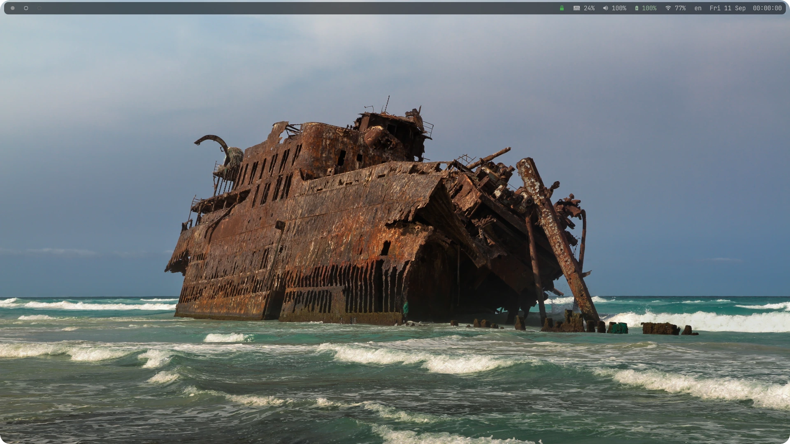

<div align="center">

**A machine-neutral Arch Linux workspace built around the
[niri](https://github.com/YaLTeR/niri) tiling compositor and a
keyboard-driven terminal stack, everything in JetBrains Mono.**



</div>

What one run installs and links, as setup.sh reports it at the end.

```
[setup] installed components
  [ + ] Niri           scrollable-tiling Wayland compositor
  [ + ] Dotfiles       config, bin, icons, applications linked; templates copied
  [ + ] Session units  waybar, mako, wallpaper, swayidle, polkit-agent, udiskie, cliphist
  [ + ] Xwayland-sat.  X11 bridge, auto-spawned by niri
  [ + ] Plymouth       boot splash (mono theme)
  [ + ] Greetd         login page (monogreet on niri)
  [ + ] PipeWire       audio server (pulse shim)
  [ + ] Portals        xdg-desktop-portal gtk + gnome
  [ + ] SSH agent      gcr-ssh-agent (gcr-4)
  [ + ] Polkit agent   polkit-gnome (the password dialogs)
  [ + ] Bluetooth      bluez + bluetui (bar module, popup)
  [ + ] Alacritty      terminal emulator
  [ + ] Rofi           application launcher (wayland 2.0)
  [ + ] Waybar         status bar
  [ + ] Mako           notification daemon
  [ + ] Swaybg         wallpaper daemon
  [ + ] Hyprlock       screen locker
  [ + ] Swayidle       idle manager
  [ + ] Yazi           terminal file manager (+ ya)
  [ + ] Zellij         terminal multiplexer
  [ + ] Cliphist       clipboard history
  [ + ] Udiskie        removable-media automount
  [ + ] exFAT          exfatprogs (mounting exFAT media)
  [ + ] Starship       shell prompt
  [ + ] Btop           system monitor
  [ + ] Neovim         text editor
  [ + ] Files          GUI file manager (nautilus)
  [ + ] NetworkMgr     network stack (bar module, netmenu)
  [ + ] Zathura        PDF viewer
  [ + ] Imv            image viewer
  [ + ] Mpv            media player
  [ + ] Paru           AUR helper (manual installs, updates)
  [ + ] Chafa          terminal image renderer (yazi preview)
  [ + ] Archives       7zip + unzip (yazi preview and extract)
  [ + ] Fzf            fuzzy finder
  [ + ] Zoxide         directory jumper
  [ + ] Eza            ls replacement
  [ + ] Bat            cat with highlighting
  [ + ] Fd             find replacement
  [ + ] Ripgrep        grep replacement (rg)
  [ + ] Delta          git diff pager
  [ + ] Checkupdates   update probe (bar's updates module)
  [ + ] Wl-clipboard   Wayland clipboard (wl-copy/wl-paste)
  [ + ] Brightnessctl  backlight control
  [ + ] Pulsemixer     audio mixer popup
  [ + ] Ksnip          screenshot annotator
  [ + ] Screenshots    grim + slurp (shot-annotate, shot-ocr)
  [ + ] OCR            tesseract (shot-ocr)
  [ + ] Recorder       gpu-screen-recorder (record-toggle)
  [ + ] Nerd Font      JetBrainsMono Nerd Font
```

Install the base system with the
[Arch Linux guide](https://nafud.github.io/kiln/guides/arch-linux/),
then deploy the workspace with one command. The repository is the
workspace alone: the base system, its policy and its hardening are
chapters of the guide, applied on the machine and recorded there.

```
curl -fsSL https://raw.githubusercontent.com/nafud/dotfiles/main/bootstrap.sh | bash
```
